# Incode Panel — Integrated Decoupled Medical SaaS Ecosystem
## Arsitektur Ekosistem Medis Modular Terpusat

> **Dokumen ini menjelaskan mengapa dan bagaimana seluruh workspace ini bukan sekadar kumpulan website dokter biasa, melainkan sebuah ekosistem SaaS medis yang terintegrasi penuh namun terpisah secara arsitektur (decoupled) — di mana setiap modul dapat berdiri sendiri, namun saling terhubung melalui satu Central API Gateway.**

---

## 1. Apa Itu "Integrated Decoupled Medical SaaS Ecosystem"?

Kata kunci ada tiga:

**Integrated** — Setiap komponen berkomunikasi satu sama lain. Perubahan data dokter di `dashboard` langsung tercermin di website dokter, sistem booking, chatbot, dan newsletter tanpa deploy ulang.

**Decoupled** — Setiap repositori bisa hidup dan berfungsi secara mandiri. Jika `kardiologi` down, `bumil-main` tetap berjalan. Jika chatbot direset, booking engine tidak terpengaruh. Tidak ada ketergantungan runtime antar frontend — yang menjadi "jantung" hanyalah satu API Gateway.

**Medical SaaS** — Software-as-a-Service dengan model multi-tenant: satu infrastruktur melayani puluhan dokter dari berbagai spesialisasi, masing-masing dengan identitas brand, domain, konfigurasi chatbot, dan data pasien yang terisolasi.

---

## 2. Inventaris Lengkap Repositori

Workspace ini terdiri dari **16 repositori aktif** yang terbagi dalam 4 lapisan:

### Layer 1 — SaaS Core Infrastructure (4 repo)

| Repo | Nama Sistem | URL Live | Stack | Fungsi |
|------|-------------|----------|-------|--------|
| `newsletter/` | **Central API Gateway** | `newsletter-api.eka-prasaja.workers.dev` | Cloudflare Workers + Hono.js | Otak seluruh ekosistem — semua request melewati sini |
| `dashboard/` | **Super-Admin Control Portal** | `dashboard.incodepanel.com` | React 19 + Vite + Clerk + Tailwind v4 | Panel manajemen dokter, konfigurasi brand, jadwal, kampanye |
| `niramaya/` | **Booking Engine Portal** | `niramaya.incodepanel.com` | React 19 + Vite + Clerk | Portal dokter & super-admin pantau antrean booking pasien |
| `chatbot/` | **AI Chatbot Engine** | `api.incodebot.com` | Cloudflare Workers + Vectorize + Workers AI | RAG engine + `chat-widget.js` yang di-embed ke semua portal dokter |

### Layer 2 — White-Label Doctor Portals (9 repo)

Setiap portal adalah website publik untuk satu dokter spesialis, tapi ditenagai oleh infrastruktur yang sama:

| Repo | Dokter / Spesialisasi | Stack | Tenant ID |
|------|----------------------|-------|-----------|
| `Wisnu-Baskoro/` | dr. Wisnu Baskoro, Sp.BS — Bedah Saraf & Tulang Belakang | Next.js 16 + PWA | `wisnu-baskoro-k6uh8` / `site_gkz9dc` |
| `Orthopedi/` | Ortopedi AI | Next.js 16 + PWA | `orthopedi-*` |
| `bedah-saraf/` | Bedah Saraf Umum | Next.js 16 + PWA | `bedah-saraf-*` |
| `spesialis-bedah-saraf/` | Bedah Saraf Rekonstruksi | Next.js 16 + PWA | `spesialis-bs-*` |
| `bumil-main/` | dr. Sarah Amalia, Sp.OG — Maternal & Gynecology | React + Vite + PWA | `tenant-sarah` |
| `Pediatri/` | Dokter Anak (Ananda) | React + Vite + PWA | `pediatri-*` |
| `Dermatologi/` | Dermatologi AI | React + Vite | `dermatologi-*` |
| `kardiologi/` | Kardiologi & Pembuluh Darah | React + Vite | `cardiocare-*` |
| `internis/` | Spesialis Penyakit Dalam | React + Vite | `internis-*` |

### Layer 3 — Brand & Marketing Support (2 repo)

| Repo | Nama | Stack | Fungsi |
|------|------|-------|--------|
| `medbrand-agency/` | Incode Panel Landing Page | Astro 6 + Cloudflare + Tailwind v4 | Landing page agensi pemasaran medis (incodepanel.com) |
| `brand/` | Design System Token Central | Vite + React | Sentral aset brand & design token ekosistem |

### Layer 4 — Frontend Hybrid Platform (1 repo)

| Repo | Nama | Stack | Fungsi |
|------|------|-------|--------|
| `astro/` | Siber Frontend (siber.web.id) | Astro 6 + Cloudflare Workers + PWA | Platform hybrid: newsletter, blog, tools, dan host `chat-widget.js` |

---

## 3. Satu Sumber Kebenaran: Central API Gateway

Seluruh ekosistem bergantung pada **satu Worker Cloudflare** sebagai otak:

```
URL: https://newsletter-api.eka-prasaja.workers.dev
File: /newsletter/api/src/index.ts
Platform: Cloudflare Workers + Hono.js
Database: newsletter-db (D1 SQLite)
Storage: newsletter-images (R2)
Queue: email-queue (Cloudflare Queues)
AI: Cloudflare Workers AI
```

### Route Map API (dibuktikan dari kode `index.ts`)

```
GET  /                          → Health check
GET  /widget.js                 → Embeddable chat/newsletter widget JS

── Public Routes (/v1) ─────────────────────────────────────────────────
GET  /v1/{tenantId}/config      → Konfigurasi tenant (warna, nama, logo)
POST /v1/{tenantId}/subscribe   → Subscribe newsletter pasien
GET  /v1/confirm/{token}        → Konfirmasi email subscriber
GET  /v1/unsubscribe/{token}    → Unsubscribe dengan 1 klik
GET  /v1/{tenantId}/articles    → Daftar artikel publik dokter
GET  /v1/{tenantId}/articles/{slug} → Detail artikel
GET  /v1/tenant/resolve         → Resolve hostname → data tenant (dynamic white-label)

── Medical Computation Endpoints (/v1) ─────────────────────────────────
POST /v1/neuro-trauma/score     → Kalkulasi skor ICP Alert & Neuro-Trauma
POST /v1/weight-bear/calculate  → Kalkulator Partial Weight Bearing pasca-operasi
POST /v1/neuro-motor/evaluate   → Evaluasi Finger Tapping Test (jalur saraf)
POST /v1/inclinometer/evaluate  → Evaluasi ROM tulang belakang pasca-bedah
POST /v1/posture/evaluate       → Evaluasi sudut postur (tekanan saraf)
POST /v1/wound/evaluate         → Evaluasi rembesan CSF / infeksi luka operasi
POST /v1/cranial-nerve/evaluate → Skrining 12 saraf kranial (3 menit)

── Medical Booking Engine (/v1/medical) ────────────────────────────────
GET  /v1/medical/doctors                    → Daftar dokter + jadwal
POST /v1/medical/bookings                   → Booking pasien (antrean digital)
GET  /v1/medical/admin/bookings             → Lihat booking per dokter (authed)
GET  /v1/medical/admin/bookings/super       → Lihat semua booking (super-admin)

── Admin Routes (/admin) — Protected by Clerk JWT ──────────────────────
GET  /admin/tenants             → Daftar tenant milik user
POST /admin/tenants             → Daftarkan dokter baru (onboarding)
PUT  /admin/tenants/{id}        → Update konfigurasi dokter
GET  /admin/stats               → Dashboard statistik (subscriber, artikel, booking)
GET  /admin/subscribers         → Daftar subscriber
POST /admin/campaigns           → Kirim kampanye newsletter
POST /admin/ai/generate         → Generate konten artikel dari URL (AI)
GET/POST /admin/schedules       → Kelola jadwal praktik dokter

── Super Admin Routes (/superadmin) ────────────────────────────────────
GET  /superadmin/all-tenants    → Semua tenant lintas pengguna
GET  /superadmin/platform-stats → Statistik platform global

── Webhooks (/webhooks) ────────────────────────────────────────────────
POST /webhooks/resend           → Handler event email (open, bounce, dll)
```

---

## 4. Bukti Keterkaitan: Bagaimana Setiap Komponen Saling Terhubung

### A. Dashboard → API Gateway → White-Label Portals

Ketika super-admin membuka `dashboard.incodepanel.com` dan mengubah warna brand dokter:

```
dashboard/src/App.tsx
  → axios.put(`${API_BASE}/admin/tenants/{tenantId}`, payload, {Authorization: JWT})
  → newsletter-api.workers.dev/admin/tenants/{tenantId}
  → newsletter-db.tenants (UPDATE accent_color, doctor_name, clinic_name, ...)
  → Saat website dokter dibuka: GET /v1/{tenantId}/config
  → Warna & info terbaru langsung aktif (real-time, tanpa redeploy)
```

**Bukti di kode:**
- `dashboard/src/App.tsx` baris 54: `const API_BASE = 'https://newsletter-api.eka-prasaja.workers.dev';`
- `newsletter/api/src/routes/public.ts` baris 14-31: endpoint `/v1/{tenantId}/config`
- `newsletter/api/src/routes/admin.ts` baris 18-40: endpoint `GET/PUT /admin/tenants`

---

### B. White-Label Portal → API Gateway (Dynamic Tenant Resolution)

Website `bumil-main` menggunakan mekanisme **dynamic hostname resolution** — bukan hardcoded data:

```
bumil-main/src/doctor-config.js:
  doctorId: "tenant-sarah"

Saat dibuka di domain spog.incodepanel.com:
  → GET /v1/tenant/resolve?hostname=spog.incodepanel.com
  → newsletter-db: SELECT * FROM tenants WHERE domain LIKE '%spog.incodepanel.com%'
  → Return: { name, specialty, clinic, accentColor, chatbotToken, ... }
  → Website menampilkan data dokter dari database, bukan dari kode statis
```

Ini membuktikan arsitektur **white-label sejati** — satu codebase bisa melayani banyak dokter hanya dengan domain berbeda.

**Bukti di kode:**
- `newsletter/api/src/routes/public.ts` baris 619-667: `GET /v1/tenant/resolve`
- `bumil-main/src/doctor-config.js`: `doctorId: "tenant-sarah"` sebagai fallback

---

### C. White-Label Portal → Chatbot AI Engine

Setiap portal dokter meng-embed chatbot dengan cara yang sama — bedanya hanya `data-tenant-id`:

```html
<!-- Wisnu-Baskoro/src/app/layout.tsx -->
<script
  src="/chat-widget.js?v=20260525_gdpr"
  data-tenant-id="site_gkz9dc"
  data-api-url="https://api.incodebot.com"
  data-site-key="0x4AAAAAADLH-shsyjvDfhj8"
/>
```

Chatbot engine (`chatbot/`) menerima `tenant_id`, lalu:
1. Fetch konfigurasi persona AI dari `chatbot-db.tenants` (system prompt, nama bot, warna)
2. Fetch dokumen RAG dari `Cloudflare Vectorize` (index: `chatbot-index-v2`)
3. Generate respons via `Cloudflare Workers AI` (Llama 3 / 3.1)
4. Simpan riwayat chat ke `chatbot-db.chat_history` (GDPR-compliant: soft-delete)

**Bukti di kode:**
- `chatbot/wrangler.toml` baris 11-14: `binding = "VECTOR_INDEX"` (Vectorize)
- `chatbot/schema.sql` baris 2-30: tabel `tenants` dengan field `system_prompt`, `bot_name`, `greeting_message`
- `Wisnu-Baskoro/src/app/layout.tsx` baris 46-53: embed chat-widget

---

### D. Portal Pasien → Booking Engine → Multi-Channel Notifikasi

Ketika pasien booking di portal dokter atau niramaya.incodepanel.com:

```
POST /v1/medical/bookings
  {doctorId, scheduleId, patientName, patientPhone, patientEmail, complaint}

  → Cek kuota antrean (atomik via D1 SQLite)
  → INSERT bookings (bookingId: NRM-XXXXXXX, queueNumber)
  → Kirim 3 jalur notifikasi paralel:

  [A] WhatsApp via Fonnte API (FONNTE_API_TOKEN)
      → Dokter: info pasien + keluhan + link dashboard niramaya
      → Pasien: nomor antrean + nama dokter + lokasi + jadwal

  [B] Telegram via Bot API (TELEGRAM_BOT_TOKEN)
      → Dokter: pesan Markdown dengan detail lengkap booking

  [C] Email via Resend (RESEND_API_KEY)
      → Pasien: HTML karcis digital dengan nomor antrean
      → Dokter: alert booking baru masuk
```

**Bukti di kode:**
- `newsletter/api/src/routes/medical.ts` baris 53-250: endpoint booking lengkap
- Baris 100-164: Dual-path notification (WhatsApp + Telegram + Email)
- Baris 106-107: Template pesan WhatsApp dokter & pasien

---

### E. Niramaya → API Gateway (Doctor's Real-time View)

`niramaya.incodepanel.com` adalah dashboard khusus dokter untuk melihat booking masuk:

```
niramaya/src/App.tsx baris 18:
  const API_BASE = 'https://newsletter-api.eka-prasaja.workers.dev';

GET /v1/medical/admin/bookings
  Headers: {Authorization: Bearer <Clerk JWT>}
  → API Gateway verifikasi JWT via Clerk JWKS
  → Jika super-admin: tampilkan booking SEMUA dokter
  → Jika dokter biasa: tampilkan booking dokter tersebut saja
```

**Bukti di kode:**
- `niramaya/src/App.tsx` baris 18, 41-54: fetch booking dengan Clerk JWT
- `newsletter/api/src/routes/medical.ts`: endpoint `GET /v1/medical/admin/bookings`

---

### F. Newsletter → Email Campaign Engine

Ketika artikel baru dipublikasikan, admin bisa mengirim kampanye email ke semua subscriber:

```
POST /admin/campaigns
  → Ambil daftar subscriber aktif dari newsletter-db.subscribers
  → Masukkan email batch ke Cloudflare Queue (EMAIL_QUEUE)
  → queue-consumer.ts: proses batch (max 100 email per batch)
  → Kirim via Resend API
  → Update statistik: total_sent, open_rate (via webhook Resend)
```

**Bukti di kode:**
- `newsletter/api/wrangler.toml` baris 23-30: konfigurasi `email-queue` (producers + consumers)
- `newsletter/api/src/queue-consumer.ts`: handler batch email
- `newsletter/api/src/routes/webhooks.ts`: handler event Resend (open, bounce)

---

### G. AI Article Generation (Admin → AI → Artikel)

Super-admin bisa membuat artikel dari URL berita eksternal menggunakan AI:

```
POST /admin/ai/generate
  {url: "https://...artikel-kesehatan..."}
  
  → Zyte API: extract clean article text dari URL
  → Cloudflare Workers AI / Groq: generate artikel berbahasa Indonesia
  → Simpan ke newsletter-db.articles (status: draft)
  → Admin review → publish → kirim kampanye newsletter
```

**Bukti di kode:**
- `newsletter/api/src/routes/ai.ts`: route `/admin/ai/generate`
- `newsletter/api/wrangler.toml` baris 43: `ZYTE_API_KEY`
- `newsletter/api/src/index.ts` baris 33, 43: `ZYTE_API_KEY` & `GROQ_API_KEY`

---

### H. Siber Frontend → Chat Widget Distribution

`astro/` (siber.web.id) berfungsi ganda: sebagai website medis mandiri DAN sebagai host alternatif `chat-widget.js`:

```
astro/src/pages/chat-widget.js.ts (63KB!)
  → File TypeScript yang di-build menjadi endpoint /chat-widget.js
  → Bisa diembed oleh portal manapun:
    <script src="https://siber.web.id/chat-widget.js" data-tenant-id="..." />
```

**Bukti di kode:**
- `astro/src/pages/chat-widget.js.ts`: file 63KB = source kode widget
- `astro/src/pages/tools/`: direktori tools medis di Siber

---

### I. CORS Policy: Whitelist Semua Domain Ekosistem

Salah satu bukti paling kuat bahwa ini adalah ekosistem terintegrasi adalah daftar domain yang diizinkan di API Gateway:

```toml
# newsletter/api/wrangler.toml baris 37:
ALLOWED_ORIGINS = "
  https://newsletter.incodepanel.com,
  https://dashboard.incodepanel.com,
  https://niramaya.incodepanel.com,
  https://spog.incodepanel.com,
  https://bumil-antigravity.pages.dev,
  https://niramaya-booking.pages.dev,
  https://medical-saas-dashboard.pages.dev,
  http://localhost:5173,
  http://localhost:5174,
  http://localhost:5175
"

# newsletter/api/src/index.ts baris 71-73:
origin.endsWith('.incodepanel.com') ||
origin.endsWith('.wisnubaskoro.id') ||
origin.endsWith('.pages.dev')      // Allow semua staging Cloudflare Pages
```

Ini membuktikan bahwa seluruh subdomain `incodepanel.com`, domain `wisnubaskoro.id`, dan environment staging `*.pages.dev` adalah bagian sah dari ekosistem yang sama.

---

## 5. Diagram Arsitektur Lengkap

```mermaid
graph TB
    %% ─── LAYER 0: Single Database ───────────────────────────────────────
    DB[(newsletter-db\nCloudflare D1\nSQLite)]
    VDB[(chatbot-db\nCloudflare D1)]
    VEC[Vectorize\nchatbot-index-v2]
    R2A[R2: newsletter-images]
    R2B[R2: chatbot-docs]
    EQ[/email-queue\nCloudflare Queue/]

    %% ─── LAYER 1: API Gateways ──────────────────────────────────────────
    subgraph "Layer 1 — Central API Gateways (Cloudflare Workers)"
        API["Central API Gateway\nnewsletter-api.workers.dev\nHono.js | newsletter/api"]
        CHAT["AI Chatbot Engine\napi.incodebot.com\ncloudflare-ai-chatbot | chatbot/"]
    end

    API <-->|D1 R/W| DB
    API -->|Batch email| EQ
    API -->|Store images| R2A
    CHAT <-->|D1 R/W| VDB
    CHAT <-->|Semantic search| VEC
    CHAT -->|Store PDF docs| R2B

    %% ─── LAYER 2: Admin & Auth ──────────────────────────────────────────
    subgraph "Layer 2 — Admin Control Plane"
        DASH["Super-Admin Dashboard\ndashboard.incodepanel.com\nReact 19 + Vite | dashboard/"]
        NIRA["Booking Monitor\nniramaya.incodepanel.com\nReact 19 + Vite | niramaya/"]
        CLERK[Clerk Auth\nJWKS JWT Verification]
    end

    DASH <-->|"PUT /admin/tenants\nPOST /admin/campaigns\nGET /admin/stats"| API
    NIRA <-->|"GET /v1/medical/admin/bookings"| API
    DASH -.->|Auth| CLERK
    NIRA -.->|Auth| CLERK
    CLERK -.->|JWKS verify| API

    %% ─── LAYER 3: White-Label Doctor Portals ────────────────────────────
    subgraph "Layer 3 — White-Label Doctor Portals (Static + PWA)"
        direction LR
        WB["Wisnu-Baskoro\nNext.js 16 PWA"]
        ORT["Orthopedi\nNext.js 16 PWA"]
        BS["bedah-saraf\nNext.js 16 PWA"]
        SBS["spesialis-bedah-saraf\nNext.js 16 PWA"]
        BM["bumil-main\nReact+Vite PWA"]
        PED["Pediatri\nReact+Vite PWA"]
        DERM["Dermatologi\nReact+Vite"]
        KARD["kardiologi\nReact+Vite"]
        INT["internis\nReact+Vite"]
    end

    WB & ORT & BS & SBS & BM & PED & DERM & KARD & INT -->|"POST /v1/{tenantId}/subscribe\nGET /v1/{tenantId}/config\nPOST /v1/medical/bookings\nPOST /v1/*/evaluate"| API
    WB & ORT & BS & SBS & BM & PED & DERM & KARD & INT -->|"Embed chat-widget.js\ndata-tenant-id=*"| CHAT

    %% ─── LAYER 4: Support ───────────────────────────────────────────────
    subgraph "Layer 4 — Brand & Marketing"
        ASTRO["Siber Frontend\nsiber.web.id\nAstro 6 + Workers | astro/"]
        BRAND["Design Tokens\nbrand/"]
        AGENCY["Agency Landing\nincodepanel.com\nAstro 6 | medbrand-agency/"]
    end

    ASTRO -->|"Serve /chat-widget.js"| CHAT
    BRAND -.->|Design guidelines| WB & BM

    %% ─── LAYER 5: External Services ─────────────────────────────────────
    subgraph "External Services"
        RESEND[Resend\nEmail Delivery]
        FONNTE[Fonnte API\nWhatsApp Notif]
        TELE[Telegram Bot API\nDoctor Notif]
        ZYTE[Zyte API\nArticle Extraction]
        CF_AI[Workers AI\nLlama 3.1]
    end

    EQ -->|Batch send| RESEND
    API -->|Booking WA notif| FONNTE
    API -->|Booking Telegram notif| TELE
    API -->|Article scraping| ZYTE
    CHAT -->|LLM generation| CF_AI
```



---

## 6. Database Schema Terpusat (newsletter-db)

Satu database D1 `newsletter-db` melayani **semua** modul:

```sql
-- CORE TENANT MANAGEMENT
tenants          → id, name, domain, owner_id, doctor_name, doctor_specialty,
                   doctor_email, doctor_bio, doctor_cv_json,
                   clinic_name, clinic_address, clinic_maps_embed,
                   accent_color, logo_url, chatbot_token,
                   wordpress_api_url, wordpress_category_filter,
                   doctor_whatsapp, doctor_telegram_chat_id,
                   plan_type, max_subscribers, status

-- NEWSLETTER MODULE
subscribers      → id, tenant_id, email, name, status (pending/active/unsubscribed),
                   token, source, referrer, confirmed_at
articles         → id, tenant_id, title, slug, excerpt, content,
                   cover_image, status, published_at, source_url
campaigns        → id, tenant_id, subject, status, total_sent, total_opened
email_events     → id, campaign_id, subscriber_id, event_type, created_at

-- MEDICAL BOOKING MODULE
doctors          → id, tenant_id, name, email, specialty, whatsapp,
                   telegram_chat_id, str_number, sip_number
doctor_schedules → id, doctor_id, location, day, time_start, time_end, quota
patients         → id, name, phone, email, medical_record
bookings         → id, doctor_id, patient_id, schedule_id, booking_time,
                   queue_number, status, complaint
```

**Isolasi data per tenant** dijamin oleh filter `tenant_id` yang wajib ada di setiap query.

---

## 7. Autentikasi & Otorisasi: Satu Provider, Dua Peran

Seluruh ekosistem menggunakan **Clerk** sebagai Identity Provider tunggal:

```
Auth Flow:
User → Clerk Sign-In → JWT Token
JWT Token → API Gateway → Verifikasi via JWKS

JWKS URL: https://clerk.incodepanel.com/.well-known/jwks.json
```

**Dua level akses:**

| Level | User | Hak Akses |
|-------|------|-----------|
| **Super-Admin** | `eka.prasaja@gmail.com` (user_3E0QTXt9A6JN8ORv631JfzGkTs6) | Akses semua tenant, semua booking, semua konfigurasi |
| **Dokter** | Email dokter yang terdaftar | Hanya tenant milik mereka |

**Hardcoded Fallback:** Jika Clerk gagal me-resolve email (karena sinkronisasi JWT lintas-env), API Gateway memiliki mekanisme fallback yang mendeteksi super-admin berdasarkan `userId` yang di-hardcode — memastikan akses tidak pernah terblokir.

**Bukti di kode:**
- `newsletter/api/wrangler.toml` baris 39: `CLERK_JWKS_URL`
- `newsletter/api/src/routes/public.ts` baris 96-100: hardcoded super-admin fallback
- `dashboard/package.json` baris 13: `@clerk/clerk-react`
- `niramaya/package.json` baris 13: `@clerk/clerk-react`

---

## 8. Prinsip "Decoupled": Mengapa Setiap Modul Bisa Berdiri Sendiri

Inilah yang membedakan ekosistem ini dari monolith biasa:

### 8.1 No Shared Runtime
Setiap repositori memiliki `build` dan `deploy` independen. Tidak ada `npm workspace` atau `monorepo`. Setiap portal dokter adalah **static site** yang hanya terhubung ke API melalui HTTP — bukan import kode.

### 8.2 Tenant ID sebagai Kontrak
Setiap portal dokter hanya perlu tahu satu hal: **`tenantId`**. Dengan ID ini, portal bisa:
- Ambil konfigurasi brand dari `/v1/{tenantId}/config`
- Subscribe newsletter pasien via `/v1/{tenantId}/subscribe`
- Tampilkan artikel via `/v1/{tenantId}/articles`
- Embed chatbot dengan `data-tenant-id="{tenantId}"`

### 8.3 Stateless Portal + Stateful API
- **Portal dokter** = stateless (tidak menyimpan data server-side)
- **API Gateway** = stateful (semua data ada di D1, R2, Queue)
- Data pasien hasil tool monitoring = lokal di browser (`localStorage`) — tidak pernah ke server

### 8.4 Duplikasi Data Terkontrol
Beberapa data (nama dokter, WA, Telegram) di-sync antara tabel `tenants` dan `doctors`. Ini disengaja: `tenants` adalah source of truth admin, `doctors` adalah view yang dioptimalkan untuk booking engine. Sync terjadi otomatis saat admin update via `PUT /admin/tenants/{id}`.

---

## 9. Tech Stack per Layer — Ringkasan

| Layer | Stack Utama | Alasan Pilihan |
|-------|-------------|----------------|
| **API Gateway** | Cloudflare Workers + Hono.js | Edge computing — latensi <50ms global, gratis untuk volume besar |
| **Database** | Cloudflare D1 (SQLite) | Serverless SQL, terdistribusi, tidak perlu manage server |
| **AI & Vector** | Cloudflare Workers AI + Vectorize | All-in-one platform, gratis 10k req/hari |
| **Email** | Resend + Queue | Batch delivery 100 email/batch, async via Cloudflare Queue |
| **Auth** | Clerk | Multi-tenant JWT, sudah terkelola JWKS, mudah integrasi React |
| **Portal Next.js** | Next.js 16 + PWA (Static Export) | Installable di HP pasien, no server needed |
| **Portal Vite** | React 19 + Vite + PWA | Build lebih cepat untuk portal yang lebih sederhana |
| **Marketing** | Astro 6 | SSG/SSR hybrid, SEO optimal untuk halaman publik |
| **Storage** | Cloudflare R2 | S3-compatible, gratis egress, untuk gambar artikel & PDF chatbot |

---

## 10. Jalur Onboarding Dokter Baru (End-to-End)

Inilah siklus lengkap ketika seorang dokter baru bergabung ke ekosistem:

```
1. Super-Admin buka dashboard.incodepanel.com
   → POST /admin/tenants {name, doctorName, doctorSpecialty, doctorEmail, accentColor}
   → Sistem generate tenantId unik (contoh: "kalingga-k9mn2")

2. Tenant tersimpan di newsletter-db.tenants
   → Dokter bisa langsung menerima booking via niramaya.incodepanel.com

3. Chatbot di-setup via Incodebot dashboard
   → Upload PDF klinik/brochure → diproses ke Vectorize (RAG)
   → chatbot_token disimpan ke tenants.chatbot_token

4. Deploy white-label portal dokter (fork dari template yang ada)
   → Ubah tenantId di doctor-config
   → Deploy ke Cloudflare Pages
   → Tambahkan embed chat-widget.js dengan tenant ID baru

5. Dokter langsung bisa:
   ✓ Terima booking pasien + notifikasi WA/Telegram/Email
   ✓ Kelola jadwal praktik via dashboard
   ✓ Pasien subscribe newsletter → terima artikel edukasi berkala
   ✓ Chatbot AI menjawab pertanyaan pasien 24/7 sesuai konteks klinik
```

---

## 11. Mengapa Ini Bukan Monolith dan Bukan Microservices Biasa

### Bukan Monolith karena:
- Setiap portal dokter bisa **di-down** tanpa mempengaruhi portal lain
- Setiap repository memiliki **siklus deploy independen**
- Tidak ada shared codebase antar portal — hanya shared API

### Bukan Microservices konvensional karena:
- Tidak ada service-to-service communication (tidak ada gRPC, message broker antar service)
- Satu API Gateway melayani semua kebutuhan — bukan ratusan microservice kecil
- Database tidak di-shard per service — satu D1 per domain fungsi (newsletter-db, chatbot-db)

### Ini adalah **BFF (Backend for Frontend) + Multi-Tenant SaaS Pattern:**
- Satu backend gateway melayani banyak frontend berbeda
- Setiap frontend adalah tenant yang terisolasi secara logis di database yang sama
- Portal dokter = frontend yang sangat ringan, hanya HTTP client ke API

---

## 12. Checklist Bukti "Integrated Decoupled"

| Kriteria | Bukti Kode | ✓ |
|---------|-----------|---|
| Satu API melayani semua frontend | `ALLOWED_ORIGINS` di `wrangler.toml` mencakup semua domain | ✓ |
| Data terisolasi per tenant | Semua query D1 wajib filter `tenant_id` | ✓ |
| Frontend tidak berbagi kode runtime | Masing-masing repo terpisah, tanpa monorepo | ✓ |
| Auth terpusat satu provider | Clerk JWKS di satu endpoint untuk semua | ✓ |
| Notifikasi multi-channel terintegrasi | 3 jalur notifikasi paralel saat booking | ✓ |
| AI kontekstual per tenant | Vectorize per tenant, system_prompt per tenant | ✓ |
| Onboarding tanpa redeploy | Data dokter baru → langsung aktif via API | ✓ |
| White-label hostname resolution | `GET /v1/tenant/resolve?hostname=*` | ✓ |
| Stateless portal, stateful backend | Static export portal + D1 state di API | ✓ |
| Queue-based email delivery | Cloudflare Queues untuk batch email | ✓ |
| Real-time booking notification | Fonnte + Telegram + Resend dalam satu request | ✓ |
| AI article generation | Zyte scraping + Workers AI / Groq | ✓ |

**Kesimpulan: 12 dari 12 kriteria terpenuhi.** Workspace ini adalah bukti konkret sebuah Integrated Decoupled Medical SaaS Ecosystem yang production-ready.
