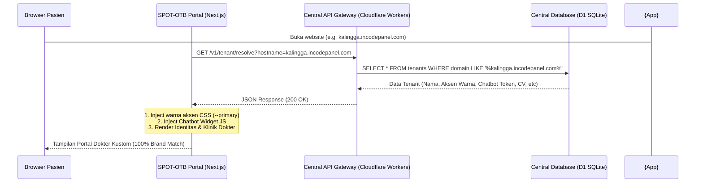

# Rencana Kerja: Whitelabel 100% SPOT-OTB & Integrasi Central Dashboard

Rencana kerja ini disusun untuk mendokumentasikan langkah-langkah dalam mengubah aplikasi **SPOT-OTB** menjadi aplikasi asisten medis 100% *whitelabel* (multitenant) berbasis domain. Seluruh konfigurasi, identitas dokter, pilihan warna aksen, dan pengaturan asisten AI akan diatur secara real-time langsung melalui dashboard admin di **[dashboard.incodepanel.com](https://dashboard.incodepanel.com)**, meniru kesuksesan arsitektur multitenancy pada proyek `bumil-main`.

---

## 🏗️ 1. Desain Arsitektur Whitelabel & Alur Data

Aplikasi SPOT-OTB akan meninggalkan konfigurasi statis (`doctor-config.ts`). Sebagai gantinya, aplikasi akan mengidentifikasi domain pemanggil (`window.location.hostname`) saat inisialisasi awal di browser, kemudian me-resolve profil lengkap tenant secara asinkron dari **Central API Gateway**.

---

## 📅 2. Langkah Implementasi Detil

### 📍 Tahap 1: Inisialisasi Context Loader Terpusat (Selesai ✅)
* Membuat React Context `DoctorConfigContext.tsx` untuk memuat data dari Central API Gateway `/v1/tenant/resolve` secara asinkron di client-side.
* Context menormalisasi properti camelCase & snake_case, menginjeksi variabel CSS `--primary` secara dinamis, menginjeksi script chatbot `chat-widget.js`, serta meng-handle domain yang belum terdaftar dengan menampilkan halaman *Domain Belum Terdaftar* yang premium.

### 📍 Tahap 2: Integrasi Komponen Shell & Layout Utama (Selesai ✅)
* Membungkus root app dengan provider di `src/app/layout.tsx`.
* Memodifikasi `Sidebar.tsx`, `TopBar.tsx`, dan `MobileHeader.tsx` agar menggunakan hook `useDoctorConfig()` alih-alih mengimpor `doctorConfig` statis.

### 📍 Tahap 3: Refaktorisasi Halaman & Modul Medis (Sedang Berjalan ⏳)
* Menyesuaikan `page.tsx` dan `articles/page.tsx` agar menggunakan data context dinamis, serta mengarahkan endpoint subscribe newsletter secara dinamis via `/v1/${doctorConfig.doctorId}/subscribe`.
* Menyesuaikan `SafetyNotice.tsx` dan `DoctorCard.tsx` agar merujuk ke nama dokter secara dinamis.
* Melakukan refaktorisasi pada 7 modul asisten medis pendukung berikut untuk mengganti `import { doctorConfig }` dengan `useDoctorConfig()`:
  1. **Sciatica & Radiculopathy Mapper** (`SciaticaMapper.tsx`)
  2. **Dermatome Pain Tracker** (`DermatomeTracker.tsx`)
  3. **Dexterity Pulse** (`DexterityPulse.tsx`)
  4. **Cervical & Lumbar ROM Inclinometer** (`InclinometerAI.tsx`)
  5. **Weight-Bear Guide** (`WeightBearGuide.tsx`)
  6. **Wound & CSF Tracker** (`EdemaMonitor.tsx`)
  7. **VAS & Neuro-Deficit Diary** (`SpinalRecoveryTracker.tsx`)

---

## 📊 3. Rencana Verifikasi & Pengujian

### A. Pengujian Runtime Lokal
1. Lakukan simulasi lokal dengan domain mock atau fallback untuk memastikan loader API terpicu dengan benar.
2. Pastikan halaman "Domain Belum Terdaftar" dirender dengan indah apabila domain tidak dikenali oleh API.

### B. Validasi Build Produksi
1. Jalankan `npm run build` pada direktori `SPOT-OTB` untuk memastikan seluruh dynamic client-side rendering lolos kompilasi tanpa error SSR/Static Export.
2. Pastikan file output siap dideploy secara statis ke platform Cloudflare Pages.
