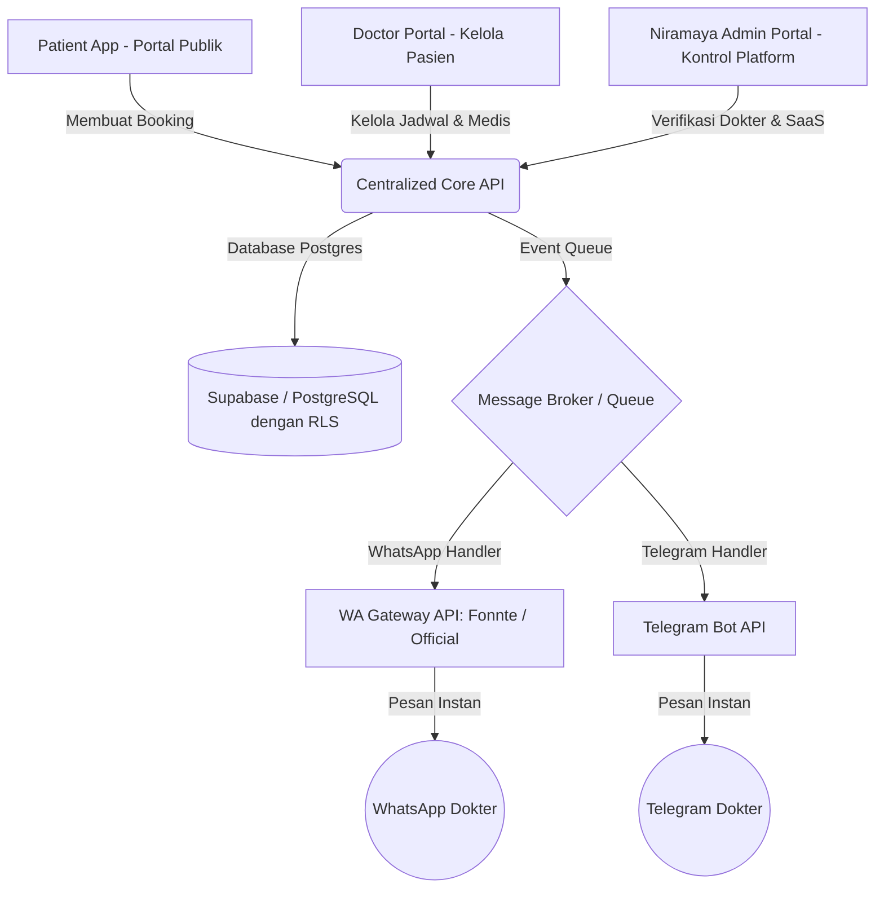

# Product Requirement Document (PRD)
## Multi-Tenant Medical SaaS Platform: Booking Engine & Niramaya Admin Dashboard

---

## 1. Executive Summary & Objective
Platform dr. Wisnu Baskoro akan dikembangkan menjadi sebuah **SaaS Medis Multi-Tenant** yang menampung hingga **10.000+ dokter spesialis** di seluruh Indonesia.

Tujuan utama dari sistem baru ini adalah menyediakan:
1. **Booking & Registration Engine**: Sistem penjadwalan terpadu di mana pasien dapat memilih dokter, melihat kuota, dan melakukan reservasi kedatangan secara real-time.
2. **Centralized Niramaya Admin Dashboard**: Dashboard khusus pemilik platform (Owner) berbasis proyek lokal **`niramaya`** di **`niramaya.incodepanel.com`** untuk mengelola data 10.000+ dokter, melacak statistik booking harian, dan mengatur lisensi SaaS.
3. **Automated Doctor Notification Dispatcher**: Pengiriman pesan notifikasi otomatis yang instan via **WhatsApp & Telegram** langsung ke nomor HP masing-masing dokter saat ada booking baru masuk.

---

## 2. Arsitektur Multi-Tenant yang Direkomendasikan
Untuk mengelola 10.000 dokter secara efisien tanpa menurunkan performa, sistem wajib dipisah menjadi 3 bagian utama (Decoupled Micro-frontend):



---

## 3. Fitur Utama & Kebutuhan Fungsional

### A. Core Booking Engine (Patient Facing)
* **Pencarian Dokter Pintar**: Pencarian berdasarkan nama, spesialisasi (misal: *Spine & Pain*), lokasi terdekat, atau nama rumah sakit.
* **Kalender Slot Real-Time**: Kalender jadwal interaktif yang menunjukkan ketersediaan slot kosong (misal: *Senin, 09.00 - 10.00: Sisa 2 kuota*).
* **Formulir Registrasi Pasien**: Input data dasar pasien, keluhan utama, riwayat penyakit, serta dokumen penunjang (seperti file MRI atau hasil lab).
* **Karcis Kunjungan Digital**: QR Code tiket antrean digital yang dapat diunduh oleh pasien setelah reservasi berhasil dikonfirmasi.

### B. Niramaya Management Dashboard (Owner Facing)
* **Manajemen 10.000+ Dokter**:
  * Daftar tabel data dokter dengan fitur pencarian cepat, filter status, dan penyaringan spesialisasi.
  * Fitur persetujuan (*approval*) dokter baru yang mendaftar ke SaaS (verifikasi STR & SIP).
* **Log Booking Global**: Riwayat seluruh transaksi booking real-time dari semua dokter secara terpusat untuk audit sistem.
* **Integrasi Payment Gateway**: Untuk opsi berbayar, mencatat pembayaran biaya booking/konsultasi sebelum pasien mendapatkan nomor antrean.
* **Pusat Konfigurasi Integrasi**: Pengaturan API token WhatsApp Gateway dan Telegram Bot secara terpusat di `niramaya.incodepanel.com`.

### C. Automated Instant Notification (WhatsApp, Telegram, & Email for Doctors & Patients)
Sistem notifikasi dua arah (*Two-Way Notifications*) menjamin komunikasi real-time yang lancar dan mudah digunakan baik oleh Dokter maupun Pasien.

#### 1. Notifikasi untuk DOKTER (Doctor Alerts)
Setiap kali ada booking baru, dokter akan menerima notifikasi instan melalui 3 saluran:
* **WhatsApp**:
  ```text
  Halo dr. [Nama Dokter], Sp.BS.
  Ada booking baru dari pasien di Wisnu SpineCare:
  Nama Pasien: [Nama Pasien]
  Waktu: [Hari], [Tanggal] - Pukul [Jam Kunjungan] WIB
  Keluhan: [Keluhan Utama]
  
  Kelola kunjungan & antrean Anda di:
  https://niramaya.incodepanel.com/doctor/bookings
  ```
* **Telegram**: Bot mengirimkan kartu detail pasien digital instan lengkap dengan tautan lampiran file rekam medis/MRI.
* **Email**: Notifikasi ringkasan HTML premium dikirim ke email dokter via integration `newsletter` API.

#### 2. Notifikasi untuk PASIEN (Patient Alerts)
Setelah berhasil memesan jadwal, pasien langsung menerima konfirmasi resmi melalui 3 saluran:
* **WhatsApp**:
  ```text
  Halo Bpk/Ibu [Nama Pasien],
  Pendaftaran Anda di [Nama Klinik/Dokter] BERHASIL dikonfirmasi.
  No. Antrean: #[No Antrean]
  Waktu Kunjungan: [Hari, Tanggal] - Pukul [Jam Kunjungan] WIB
  
  Tunjukkan tiket digital Anda saat tiba di lokasi:
  https://niramaya.incodepanel.com/ticket/[ID Booking]
  ```
* **Telegram**: Bot resmi mengirimkan karcis kunjungan digital interaktif dan pengingat otomatis H-1 sebelum konsultasi.
* **Email**: Email konfirmasi karcis digital dengan QR Code terlampir untuk mempermudah check-in fisik di klinik.

---

## 4. Kebutuhan Non-Fungsional (Keamanan & Skalabilitas)
* **Supabase / PostgreSQL dengan Row Level Security (RLS)**: Sangat penting! Mencegah dokter A melihat rekam medis atau data booking pasien dari dokter B. Setiap query wajib disaring berdasarkan `tenant_id` (ID Dokter).
* **Serverless Edge Functions**: Skalabilitas dinamis menggunakan Cloudflare Workers atau Vercel Edge Functions untuk menangani lonjakan trafik pendaftaran 10.000 dokter tanpa crash.
* **Queue System (Redis / Cloudflare Queues)**: Mencegah kegagalan pengiriman WA/Telegram saat ratusan pasien melakukan booking secara bersamaan. Pesan akan masuk antrean pengiriman secara teratur.
